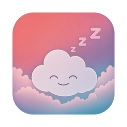

<p align="center">
  
</p>

# SSH-Wakey

Version **1.3.0** (build **5**). See the [release notes](CHANGELOG.md).

A small native macOS app that keeps a list of SSH destinations so you do not
have to remember usernames, addresses and ports when you need to get back into
a machine.

It is a launcher, not a terminal. The password is typed once per attempt, used
once, and thrown away.

**Standard** (`com.CadenGithubB.sshwakey`) is the public app. You add machines,
choose Wake or Open a session per host, and can encrypt the saved list. It
never reads a configuration profile.

**Managed** (`com.CadenGithubB.sshwakey.managed`) is the IT copy. Jamf assigns
the list. Wake only: no add, edit, remove, export, or Terminal. The employee
still types the office Mac password; nothing in the profile is a secret.
Notes and the schema are in [docs/jamf/README.md](docs/jamf/README.md).

- Swift and SwiftUI, macOS 14 or later
- No third-party dependencies at all
- No SSH password or private-key storage, no sync, no telemetry, no discovery

---

## Build and run

Requirements: macOS 14+, Xcode 16 or later. Nothing to install, nothing to fetch.

In Xcode:

```bash
open SSH-Wakey.xcodeproj
```

Then press ⌘R to run, or ⌘U to run the tests. In Xcode the scheme menu is
**SSH-Wakey** (Standard) or **SSH-Wakey Managed** (IT). One project, two
schemes, the same sources. A compile flag in the Managed scheme is what locks
that binary; it is not a second repo.

From the command line:

```bash
xcodebuild -project SSH-Wakey.xcodeproj -scheme SSH-Wakey -configuration Release build
```

```bash
xcodebuild -project SSH-Wakey.xcodeproj -scheme SSH-Wakey -destination 'platform=macOS' test
```

**Run the Release build.** It has the Hardened Runtime on and no
`get-task-allow` entitlement, restricting ordinary debugger attachment and code
injection. The main app's Debug configuration permits debugger attachment;
both password helpers retain Hardened Runtime in every configuration.
[SECURITY.md](SECURITY.md) explains these boundaries and how to check a build.

Local builds are ad-hoc signed (`CODE_SIGN_IDENTITY = "-"`). The main app runs
`/usr/bin/ssh` and writes its private trust and connection files outside a
sandbox container. It and the metadata-only askpass adapter are unsandboxed.
The password-entry XPC service is separately signed and sandboxed, with no
network or general user-file access entitlement. Distribution still requires
Developer ID signing, notarisation, and validation on the target Macs.

---

## Installing it

```bash
./Scripts/install.sh
```

Builds the Release configuration and puts the app in `/Applications`. Release is
the one to install: it has the Hardened Runtime on and no `get-task-allow`
entitlement. The scripts reject missing runtime protection, invalid signatures
and debug/code-loading exception entitlements. Debug is for development and
permits debugger attachment.

Run it again to update. It replaces the bundle rather than merging into it, so a
renamed or deleted file cannot leave something stale behind, and it refuses to
touch `/Applications/SSH-Wakey.app` if that turns out to be some other app.

This script builds and installs a local ad-hoc-signed app. Its signature checks
verify bundle integrity and hardening; they do not provide Developer ID signing
or notarisation for distribution.

### Managed copy for Jamf

The Standard app never reads a configuration profile. A work VPN or Mail profile
on a personal Mac cannot take over someone’s home copy.

The **SSH-Wakey Managed** scheme (`com.CadenGithubB.sshwakey.managed`) is the IT
build: Wake only, list from a forced Jamf payload, no add/edit/export. The
catalog is the live profile, not a copy into `connections.json`. Learned
Ethernet addresses for Wake are kept in a small local cache. Notes and the
schema are in [docs/jamf/README.md](docs/jamf/README.md).

```
xcodebuild -project SSH-Wakey.xcodeproj -scheme "SSH-Wakey Managed" -configuration ManagedRelease build
```

```bash
./Scripts/make-dmg.sh
./Scripts/make-dmg-managed.sh
```

The first writes `build/SSH-Wakey.dmg`. The second writes
`build/SSH-Wakey-Managed.dmg`.

### Moving it to another Mac

```bash
./Scripts/make-dmg.sh
```

Writes `build/SSH-Wakey.dmg`. For the IT copy:

```bash
./Scripts/make-dmg-managed.sh
```

Writes `build/SSH-Wakey-Managed.dmg`. These scripts currently produce local
ad-hoc-signed verification builds, not notarised distribution artifacts. Before
sharing either app, sign all components with Developer ID, notarise the result,
and test installation and password entry on the supported target systems.
The same distribution checks apply to the Managed app deployed through Jamf.

---

## Using it

1. **Add** a connection: display name, username, host or IP, port, and any extra
   `ssh` options. Nothing is flagged as wrong until you press Save. Wake versus
   Open a session is chosen here too, and remembered on that connection.
2. Select a connection. The menu beside the button is for **that** machine.
3. Press **Wake** (the default) or **Connect**, or double-click the row.
4. Verify an unknown host using its independently obtained fingerprint, then
   type the password in the native popup when SSH requests it. The popup shows
   the destination and requested action. To change the action, cancel the popup
   and select Wake or Connect in the main window.

The rest of this section is Standard. The Managed copy has no Add, Edit, or
Open a session: select an assigned machine and press Wake.

### The two things the button can do

**Wake** is the default. It logs in to prove the password works and closes the
connection immediately. That is all a Mac waiting at the FileVault screen
needs: the login is what unlocks its disk, and nothing has to stay open
afterwards. Nothing is left running and no Terminal window opens.

On a local address it first sends a short wake packet the machine can hear
while asleep, waits, then starts SSH. The status line says **Waking the
machine...** during that. If TCP still times out, it pokes once more and
tries SSH again. This is not Apple Remote Desktop; it is the same idea: wake
first, then log in.

A verified helper callback runs after SSH authenticates, allowing the app to
recognize success even when the target immediately disconnects. It does not
trust diagnostic text or the process exit code as evidence of authentication.

**Open a session** (the button then says **Connect**) logs in and holds the
connection open. When it says Connected, **Open in Terminal** starts a shell on
that already-authenticated connection without asking for the password again. If
the machine hangs up straight after accepting the password, which is what
unlocking a disk looks like, the app says so rather than reporting a failure.

Each saved connection remembers which of those two you chose, so waking one Mac
does not change what the button does on the next.

Double-clicking a row that is already connected opens another Terminal window on
the same session.

**Disconnect** closes the session. So does quitting the app, which is why it asks
first when sessions are open.

The list shows when each connection was added and last edited. Open **Edit** to
see the full change history for one: what changed, and when.

Usernames, addresses, extra arguments and dates are masked in the list. The
**eye** beside each row's status dot reveals that one, and hides whichever was
revealed before, so at most one machine is ever readable at a glance. Names are
always shown, since that is how you pick one. Right-clicking a row offers the
same thing.

It is a display setting and nothing more. Nothing about what is saved changes,
and the password sheet always shows the real destination, because confirming
where a password is about to go is the point of that sheet.

**Port** and **Extra arguments** are optional columns. Switch them off from the
sliders button in the top-left corner of the table header, above the status dot,
or by right-clicking the table header. Name, Username, Host, Added and Last edited always show, because a row
that cannot tell you which machine it is or who it logs in as is not worth
showing.

Which columns show, and in what order, is remembered between launches. Their
widths deliberately are not. SwiftUI writes the width it has just worked out back
into the saved layout, so storing that verbatim pins every column at whatever the
window happened to be that day; reopened in a smaller window, those widths no
longer fit and the table scrolls sideways instead of shrinking. Widths are
stripped before saving, and the window cannot be made narrower than every column
at its ideal width, so the default layout never scrolls sideways.

Right-click a single row for **Activity…**: the recent connection attempts for
that machine, while this app has been open. It is the same record **Save
Diagnostics…** writes out, filtered to one host. Nothing about attempts is
written to the connections file.

Command-click or Shift-click several rows to select them. Multi-select is for
**Remove** only. Wake, Connect and Edit need one machine; offering them for a
set would mean guessing a password or a destination.

Edit appears only when exactly one connection is selected, rather than sitting
there greyed out. Remove works for one row or several. Both are refused while
any selected machine has a session open. The gear beside them opens Settings,
where encryption lives.

The **Help** menu has **Save Diagnostics…**, which exports recent curated
connection statuses and destination metadata. Raw server output and prompts are
excluded because an SSH server can reflect a password into them. **Activity…**
shows the same bounded, in-memory history for one machine.

The **?** button opens **What SSH-Wakey does**: what it saves, how Wake and
Connect work, what reaching a Mac at the FileVault screen needs, and what the
different failures mean.

The **i** button beside the extra arguments field lists the `ssh` options worth
knowing, with a line each on what they do, and says what SSH-Wakey refuses.

### How the connection actually works

Connect starts one `ssh -M -N` process. `-N` means it runs no remote command; it
exists only to hold an authenticated connection open, with a control socket in a
private folder under your temporary directory.

Open in Terminal then starts an ordinary `ssh` client that attaches to that
control socket. Because the master is already authenticated, the new client asks
for nothing. No keystrokes are simulated, no application is scripted, and the
password is never anywhere near Terminal.

The trade-off is that the session belongs to SSH-Wakey. Quit the app and the
master goes away, taking attached Terminal windows with it.

---

## Saved connections

Standard keeps metadata only in:

```
~/Library/Application Support/SSH-Wakey/connections.json
```

Pretty-printed JSON written through `Codable`:

```json
{
  "version" : 1,
  "connections" : [
    {
      "createdAt" : "2026-09-11T09:14:02Z",
      "extraArguments" : "-o ServerAliveInterval=30",
      "host" : "192.168.1.24",
      "id" : "7C6C1E5E-...",
      "modifiedAt" : "2026-09-12T18:03:41Z",
      "name" : "Studio Mac",
      "port" : 22,
      "connectMode" : "unlock",
      "revisions" : [
        {
          "date" : "2026-09-12T18:03:41Z",
          "id" : "1F2A...",
          "summary" : "Host: 192.168.1.9 → 192.168.1.24, Port: 22 → 2222"
        }
      ],
      "strictHostKeyChecking" : true,
      "username" : "admin"
    }
  ]
}
```

Timestamps are ISO-8601 and kept to the second, so what is written is exactly
what is read back. `revisions` records what changed and when, capped at the 20
most recent so the file cannot grow without bound. A connection saved by an
earlier build has no dates, and the app shows a dash rather than inventing one.

The folder is created `0700` and the file is written `0600`, so only your account
can read it. Writes are atomic, and permissions are reapplied after every save
because an atomic write replaces the file.

The Managed build does not use this file. Its list is the forced Jamf payload,
read live. Alongside its private host-key trust file, it may write
`~/Library/Application Support/SSH-Wakey Managed/link-addresses.json`, a host →
MAC cache for Wake, still `0600` and still not a password. Standard keeps learned
MAC addresses within its connection file, including when encrypted, and removes
the legacy plaintext sidecar when enabling/opening encryption.

There is no password field, and there never will be. You can edit the file by
hand while the app is closed; anything invalid is caught by the same validation
the editor uses. A file written by an older build still loads, and a file from a
newer format version is refused rather than misread. A file that is garbage, or
an encrypted file whose seal no longer matches, is refused as damaged or
altered — the window says so, rather than quietly loading an empty list.

### Encrypting the file

Off by default. Turn it on in Settings (⌘,), where you choose a recovery
passphrase.

Once on, the file holds nothing readable: no names, no usernames, no addresses.
The list is sealed with AES-GCM under a random key, and that key is then wrapped
twice, so there are two independent ways in.

- **A local key.** Initially kept in your Keychain and used silently when the
  app opens. Optional [App Lock](#app-lock) replaces this with a Secure Enclave
  key that requires Touch ID or your Mac login password.
- **Your recovery passphrase.** An independent way in if the local key is
  unavailable, including after a Keychain reset or a move to a new Mac. Put it
  in your password manager. It is not meant to be memorised.

Losing one does not lose the data. This is the same shape as a disk encryption
recovery key: the passphrase does not decrypt the file, it decrypts the key that
does. Changing the passphrase rotates that data key and re-encrypts the file,
so an old vault copy and its passphrase cannot decrypt future saves.

Without App Lock, recovery restores missing Keychain access so the next launch
is silent again. With App Lock, recovery opens the current session and keeps
automatic locking enabled. Nothing can be edited while it is locked.

**Export a Readable Copy** writes an ordinary unencrypted file, in exactly the
format an unencrypted install uses, so it can be read by eye or put straight
back. It is the copy to keep somewhere safe before you need it, and to keep out
of shared folders. Turning encryption off does the same thing in place and
removes the Keychain key. Exporting, turning encryption off and changing the
passphrase all ask for the current passphrase first, so every route to a lasting
plain-text copy needs the same proof.

The passphrase sheet can generate a strong one and copy it explicitly. Clipboard
privacy hints and clearing after ninety seconds reduce exposure but do not
prevent another application from reading a copied secret. The Open Passwords
button opens Apple's app so you can save the recovery passphrase there yourself.

Export once as soon as you turn encryption on. If the passphrase is ever
forgotten while the Keychain key still works, the file opens but cannot be
exported, turned off or re-keyed, and the only way out is to read the
connections off the screen and enter them again.

FileVault protects storage at rest; locking the screen does not relock a mounted
volume. File permissions restrict other accounts, and the metadata file holds no
SSH passwords or private keys. Encrypting it closes three narrower gaps: a program running as you
reading it directly, an unencrypted backup destination, and the file being copied
somewhere by accident. SECURITY.md is explicit about what it does and does not
buy.

### Validation

A connection must have a name, a username and a host, and a port from 1 to
65535. Usernames and hosts may not contain spaces, `@`, `/`, control characters
or a leading dash, since a leading dash would be read by `ssh` as an option.

Extra arguments are split by the app, honouring quotes and backslashes, and are
passed to `Process` as an array. No shell is involved, so `;`, `|`, `$(...)` and
friends are just characters. Options are then checked:

- `-o` options are an allow list: only a fixed set that tunes how the one
  connection is made is accepted, so a keyword nobody has vetted — including a
  future one that can run code — is refused by default. `ProxyCommand`,
  `LocalCommand`, `PermitLocalCommand`, `KnownHostsCommand`, `PKCS11Provider`,
  `Match`, `Include` and `UserKnownHostsFile` are also named so the refusal
  explains itself.
- Refused as dangerous flags: `-F` (an alternate config file that can contain
  any of the above) and `-I` (loads a PKCS#11 library into `ssh`, the
  command-line twin of `PKCS11Provider`).
- Refused as reserved: options the app sets itself, such as `-p`, `-l`, `-M`,
  `-S`, `-q`, `StrictHostKeyChecking`, `LogLevel` and `ControlPath`.
- Refused as unrecognised: any flag that is not a real `ssh` option, and any
  bare operand, since the destination comes from the fields.

SSH-Wakey runs `ssh` with `-F /dev/null`, disables global trust files, and uses
a validated snapshot of its own private `known_hosts` file in Application
Support. User and system config cannot inject commands or override host trust.
Strict host-key checking is always enabled. Old settings that disabled it are
normalized to strict checking. Unknown Ed25519 keys require an independently
obtained fingerprint before enrollment; changed keys are refused.

Jump hosts (`-J`), forwarding, arbitrary local commands, authentication overrides
and algorithm downgrades are unsupported. Extra options are limited to IP version,
verbosity, identity-file selection, identities-only behavior and bounded
connection/keepalive tuning. Existing connections using removed options must be
edited before use.

## How passwords are handled

SSH invokes a small signed adapter, which opens a separately signed, sandboxed
password-entry service. Only that short-lived service contains the native popup. The main app no longer has a SwiftUI password binding,
password buffer or socket carrying the password. The helper and app verify each
other's code identity and the exact registered SSH parent. A copied environment
or a genuine helper launched from an unrelated process is refused.

The popup displays the app-provided destination. On submission, the helper copies
UTF-8 directly into locked, wipeable memory, rechecks authorization, writes to
SSH's pipe, wipes its controlled buffer and exits. Locking failure prevents
submission. Only one password prompt is authorized per attempt; repeated prompts
are refused. Cancellation and a two-minute prompt deadline close the helper.
The app does not intentionally save SSH passwords, put them in arguments or
environment variables, or include them in diagnostics.

A native field still makes AppKit-managed copies and a brief Swift String bridge.
Those copies cannot be guaranteed erased. The helper confines SSH input copies to
a process that exits; OpenSSH and OS-managed memory are separate boundaries.
The service has no network or general file-access entitlements. It receives only
an already-authorized channel, SSH's output pipe, and read-only code handles for
caller verification. macOS still gives sandboxed processes access to their own
container and necessary system resources; this is not a claim of zero filesystem
access. Recovery passphrases also cross native/cryptographic framework boundaries.
[SECURITY.md](SECURITY.md) documents the complete memory and threat model without
claiming that plaintext never exists in RAM.

Success comes from a verified helper callback that OpenSSH runs after
authentication. Banners and even internal diagnostic lines can be forged by a
server, so they never count as authentication evidence. The Terminal client
attaches to the existing master and fails closed if it disappears.

## SSH authentication limitations

- **A single password prompt.** Multi-step challenges, one-time codes and forced
  password changes are unsupported. The app refuses a second prompt.
- **Key authentication.** System SSH can use default/selected identity files or
  an existing agent. The app does not read or store private keys or answer key
  passphrase prompts. Successful key authentication needs no password popup.
- **Independent host trust.** Trust is specific to each SSH-Wakey distribution.
  Existing `~/.ssh/known_hosts` entries are not automatically imported. Ed25519
  is the supported host-key algorithm; verify the fingerprint on the target or
  through another trusted channel before enrolling it.
- **One session per saved connection** at a time. Jump hosts and forwarding are
  deliberately unavailable in this password flow.

---

## FileVault and the startup screen

A Mac with FileVault turned on does not finish starting up by itself after a
restart. It stops at a login screen while its disk is still encrypted. That
screen looks ordinary, but almost nothing is running behind it, including the
part of macOS that answers SSH.

Whether you can reach a Mac sitting there depends on which version of macOS is
on **that** Mac. The version running SSH-Wakey makes no difference.

### macOS 26 (Tahoe) or newer on the target: you can get in

Apple added a way to unlock the disk over SSH. You connect the way you normally
would and enter the password for an account on that Mac. That password unlocks
the disk and lets it carry on starting up. There is nothing special to switch on
in SSH-Wakey.

The connection drops a second or two after it succeeds. That is not a failure:
the Mac closes it while it finishes starting. SSH-Wakey recognises a session that
ends within 30 seconds and says so, rather than reporting it as an error. Wait
about half a minute and connect again for a normal session.

### macOS 15 (Sequoia) or older on the target: you cannot

No SSH server is running at that screen, so there is nothing to connect to. No
SSH client can do it. Someone has to unlock that Mac at its own keyboard, and SSH
works normally from then on.

### What to set up first

All of this has to be arranged while you can still reach the Mac. None of it can
be done once it is already sitting at the FileVault screen waiting.

- **Turn on Remote Login, in advance.** On the Mac you want to reach: System
  Settings ▸ General ▸ Sharing ▸ Remote Login. This is what lets anything connect
  over SSH at all.
- **Plug it into Ethernet.** Wi-Fi does not start until after the disk is
  unlocked, so a Mac on Wi-Fi alone is not on the network at that screen. A cable
  is the difference between reaching it and not.
- **Know which account to use.** The password has to belong to a user who is
  allowed to unlock FileVault on that Mac.
- **Try it once on purpose.** Restart that Mac deliberately and unlock it over
  SSH while you are still next to it. Finding the gap then beats finding it
  during a real problem.

### If unlocking over SSH is not an option

These work on any version of macOS.

- **Restart in a way that skips the lock screen.** Before a planned restart, run
  `sudo fdesetup authrestart` on that Mac instead of restarting normally. It
  saves a one-time unlock key, so the Mac starts straight past the FileVault
  screen and comes back on the network by itself.
- **Have someone unlock it.** Anyone at the keyboard can type the password.
- **Use hardware that can see the screen.** A KVM, a remote management card or a
  device management tool reaches the startup screen directly. An SSH client
  cannot.

All of this is in the app as well, under **What SSH-Wakey does**, behind the **?**
button and the link that appears when a connection fails.

Sources for the Tahoe behaviour: [Jeff Geerling on managing FileVault Macs
remotely in Tahoe](https://www.jeffgeerling.com/blog/2025/you-can-finally-manage-macs-filevault-remotely-tahoe/)
and [Michael Tsai's summary of the Apple
documentation](https://mjtsai.com/blog/2025/09/22/tahoe-filevault-icloud-keychain-and-ssh/).

---

## Local network permission

macOS asks each app for permission before it can reach devices on your local
network, and that permission covers `ssh` too, because SSH-Wakey launches it.

If the prompt was dismissed or denied, every connection to a private address
fails as unreachable or times out, exactly as though the machine were switched
off. When a connection to a local address fails that way, SSH-Wakey says so and
offers a button straight to System Settings ▸ Privacy & Security ▸ Local
Network. If you have just granted it, connect again.

IT cannot flip this toggle with Jamf. Apple does not allow MDM to set Local
Network privacy. A Developer ID–signed Managed build is what makes one Allow
stick; ad-hoc rebuilds can prompt again.

Addresses treated as local: `10.x`, `172.16–31.x`, `192.168.x`, `169.254.x`,
`127.x`, IPv6 loopback, link-local and unique-local, any `.local` name, and any
bare name with no dots.

---

## External dependencies

There are no third-party packages. The app uses system frameworks including
SwiftUI, AppKit, Foundation, Security, CryptoKit, CommonCrypto and Carbon.
Network activity is limited to requested SSH/host-key checks, wake packets and
associated name/address lookup.

System tools are `/usr/bin/ssh`, `/usr/bin/ssh-keyscan`, `/usr/sbin/arp` and
`/usr/bin/open`. Fingerprints are computed in process. The fixed authentication
callback and private Terminal script are the two controlled shell paths.

---

## Project layout

```
SSH-Wakey/
  main.swift               Entry point; askpass mode is decided here, before any UI
  SSHWakeyApp.swift        Scene and app delegate
  Security/
    ConnectionVault.swift      The encrypted file: one data key, two key slots
    KeychainKeyStore.swift     The everyday key, in the login keychain
  Models/
    AppDistribution.swift      Standard vs Managed compile flag
    ManagedPolicy.swift        Forced Jamf payload (Managed build only)
    LinkAddressCache.swift     Learned MACs for Wake
    SSHConnection.swift        Saved metadata, Codable
    ConnectionFileStore.swift  Atomic JSON load and save with tight permissions
    ConnectionStore.swift      Observable list the window binds to
    ConnectionValidator.swift  Field rules
    SSHArgumentParser.swift    Quote-aware tokeniser plus the option allow list
  SSH/
    AskpassProtocol.swift   Contract between the app and its own askpass mode
    AskpassChannel.swift    One-attempt helper authorization and authentication status
    AskpassHelper.swift     The askpass client half
    SecureBuffer.swift      Page-aligned, locked, wipeable buffer
    SSHCommandBuilder.swift Argument arrays; validated argv and a fixed signed-helper callback
    SSHSessionManager.swift Runs the master, tracks state, owns live sessions
    SSHFailure.swift        Turns ssh's stderr into something worth reading
    HostKeyService.swift    Fingerprints and known_hosts
    TerminalHandoff.swift   Attaches Terminal to an authenticated session
    NetworkScope.swift      Tells a local address from a routable one
    ProcessRunner.swift     Small async wrapper around posix_spawn/waitpid
    DiagnosticsReport.swift Recent attempts, also written by Save Diagnostics
  Helpers/Askpass/           Signed metadata-only SSH adapter
  Helpers/PasswordInput/     Sandboxed, short-lived password-entry XPC service
  Views/                    SwiftUI window, editor, password prompt, activity, host key sheet
SSH-WakeyTests/             Security and behavior regression tests
```

## App Lock

In the standard app, turn on connection-file encryption, then choose
**Settings → Turn On App Lock**. Confirm the vault's recovery passphrase and
authenticate in the macOS dialog using Touch ID or your Mac login password.
SSH-Wakey never asks you to type your local Mac password into its own fields.

Once enabled, the app starts locked. Authentication opens it for **five minutes
without activity in SSH-Wakey**. Using Terminal or another app does not reset
that timer. Screen lock, sleep and user switching also lock the app. **Lock Now**
and **⇧⌘L** lock it immediately.

Locking cancels connection attempts, disconnects SSH sessions (including Terminal
windows attached to them), dismisses open editors, clears activity records, and
releases the open vault key and connection list. Unsaved edits are discarded.
An explicitly copied recovery phrase is cleared from the clipboard if nothing
else has replaced it. Unlocking never reconnects a previous session automatically.
Terminal scrollback and remote background jobs are outside App Lock's control.

The protected local key uses this Mac's Secure Enclave and requires macOS user
authentication. A compatible Mac is required; unsupported hardware refuses to
enable App Lock. The recovery passphrase remains an alternative way to open the
vault and does not turn App Lock off. Keep it safe: it also permits removing
App Lock or exporting readable data.

App Lock does not save or reuse remote SSH passwords. Each password-based SSH
attempt still has its own separate native prompt. App Lock also does not secure
an already compromised operating system or guarantee erasure of framework-owned
memory. See [SECURITY.md](SECURITY.md) for its boundaries.

## Tests

The suite currently contains **388 tests**, run against both the standard and
managed app variants during the September 2026 security review.

The suite covers private-file access, unavailable storage, concurrent writes,
vault metadata and independent recovery slots, key rotation, managed validation,
strict host trust, argument isolation, helper identity and replay refusal,
password lifetime rules, bounded subprocesses, Terminal fallback and isolated
session cleanup, App Lock timing and lifecycle notifications, cancelled
authentication, protected-key migration and damaged-slot recovery. All
credentials and keys in tests are synthetic. Tests must
never inspect or sweep the user's actual temporary SSH sessions.

```bash
xcodebuild -project SSH-Wakey.xcodeproj -scheme SSH-Wakey -destination 'platform=macOS' test
```
